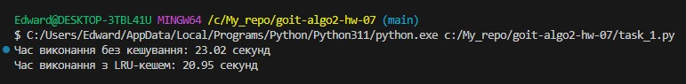
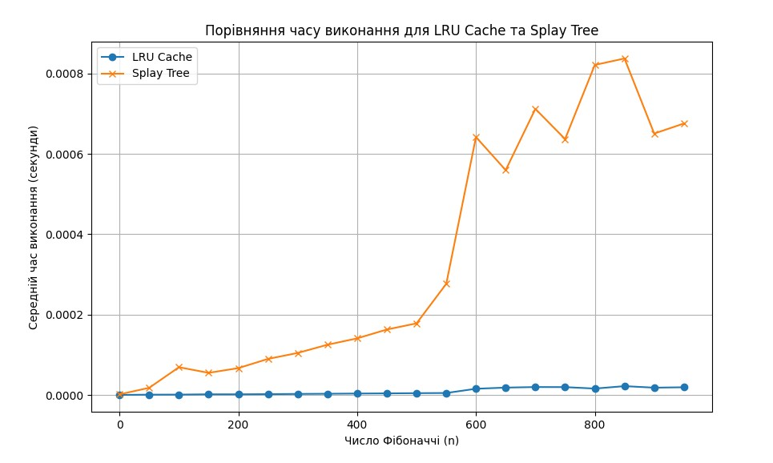
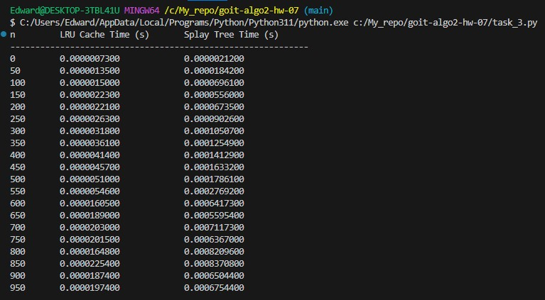

# Домашнє завдання: Алгоритми керування кешем

## Завдання 1. Оптимізація доступу до даних за допомогою LRU-кешу

## Завдання 2. Порівняння продуктивності обчислення чисел Фібоначчі із використанням LRU-кешу та Splay Tree

